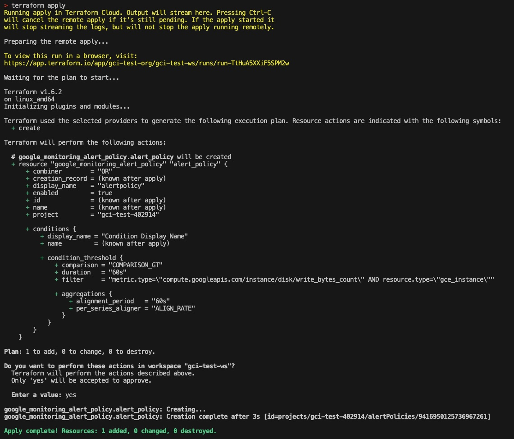
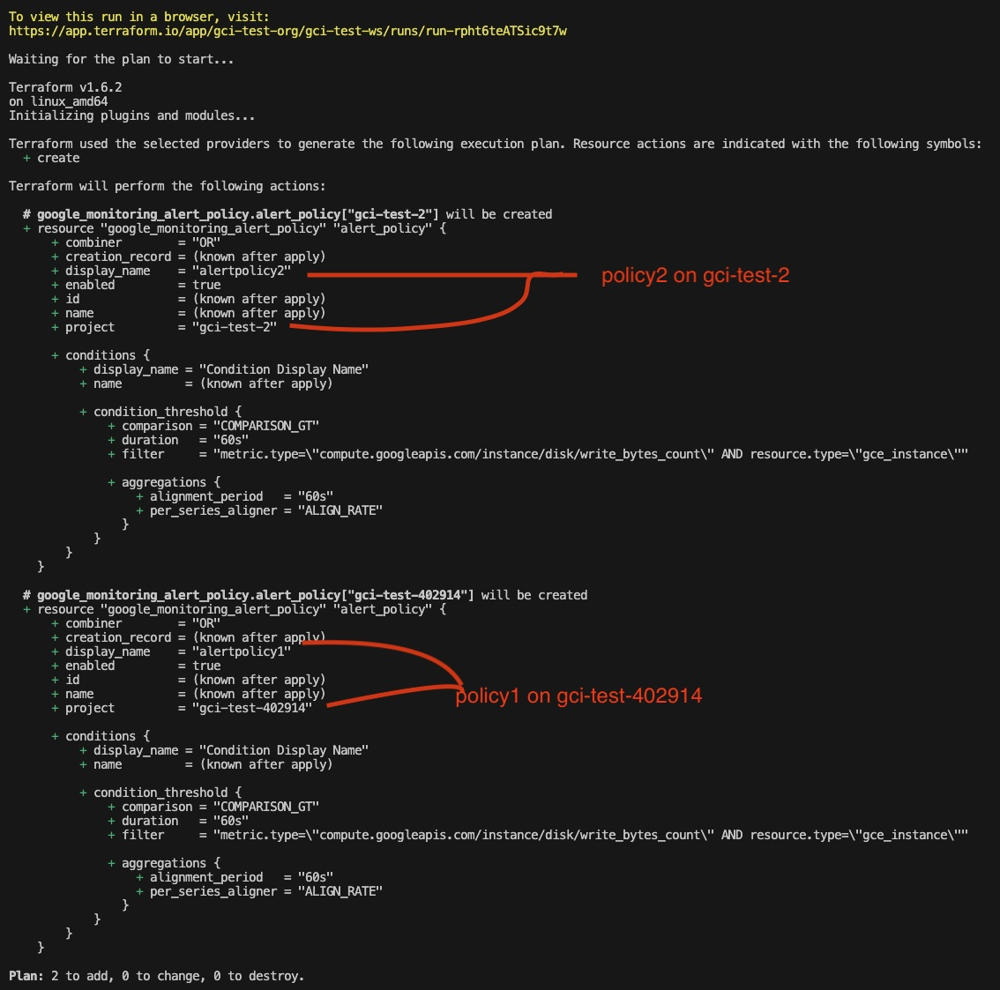
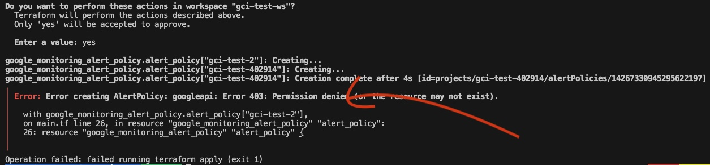

# Preuve d'exécution

# Test with two policies on 2 differents GCP projects:

While from a syntaxic point of view this terraform code works (you can look the project name and and policy are planned for 2 policies).

From a security point of view on GCP it's not working cause my **credentials.json** file is initialized with a valid token for gci-test-402914 only and not fot gci-test-2!

Theres' solutions to this problem but I have the feeling it's beyond this test!

See [multiple providers](https://medium.com/google-cloud/multiple-gcp-providers-in-terraform-64d20673519e)
